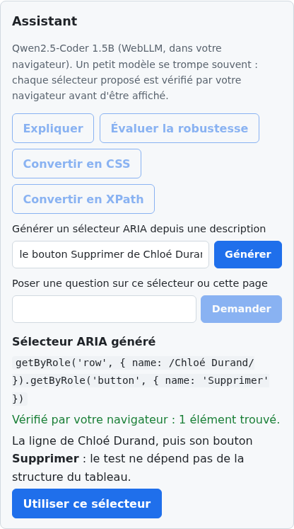

# Selector Lab

Site statique pour apprendre, chercher et tester les sélecteurs utilisés en tests end-to-end : CSS, XPath 1.0, API DOM et requêtes ARIA, avec leur support dans chaque navigateur.

- **Référence** : CSS, XPath 1.0, API DOM et Requêtes ARIA : chaque fonctionnalité, ses exemples, ses pièges et son support navigateur.
- **Testeur** : évaluer un sélecteur sur une page d'exemple ou sur son propre HTML.
- **Jeu** : progresser niveau par niveau dans une bibliothèque (CSS ou XPath), puis dans trois Scénarios e2e sur de vraies interfaces (CSS, XPath ou ARIA).
- **Assistant** : un petit modèle de langage exécuté dans le navigateur, chargé à la demande (voir [ADR 0001](docs/adr/0001-assistant-local-a-la-demande.md)). Il utilise l'IA intégrée de Chrome (Gemini Nano) si elle est disponible, sinon WebLLM sur WebGPU (Qwen2.5-Coder 0.5B, 290 Mo, ou 1.5B, 880 Mo). Dans le Testeur, il explique un sélecteur, juge sa robustesse, le convertit, en génère un depuis une description ou répond à une question ; dans le Jeu, il donne des Indices personnalisés. Chaque sélecteur qu'il propose est vérifié par le navigateur avant d'être affiché.

Le vocabulaire du projet est défini dans [CONTEXT.md](CONTEXT.md).

## Aperçu

| Accueil | Référence |
| --- | --- |
|  |  |

| Testeur | Page d'exemple |
| --- | --- |
|  |  |

| Jeu : la bibliothèque | Jeu : un Scénario e2e en ARIA |
| --- | --- |
|  |  |



*Assistant : un sélecteur généré puis vérifié par le navigateur (réponse d'illustration).*

Les captures se régénèrent avec `npm run build && npm run captures`.

## Activer l'Assistant

L'Assistant a besoin de l'un de ces deux moteurs. Le panneau « Diagnostic et comment activer l'Assistant », dans
le Testeur, indique lequel manque et pourquoi.

**IA intégrée de Chrome (Gemini Nano)**

1. Chrome 138 ou plus récent sur ordinateur : Windows 10/11, macOS 13+, Linux ou Chromebook Plus.
2. Au moins 22 Go libres sur le disque du profil Chrome, une carte graphique avec plus de 4 Go de mémoire (ou
   16 Go de RAM et 4 cœurs), et une connexion non limitée pour le premier téléchargement.
3. `chrome://on-device-internals` affiche l'état du modèle et les erreurs ; dans la console,
   `await LanguageModel.availability()` renvoie `available`, `downloadable`, `downloading` ou `unavailable`.
4. Si le modèle est à télécharger, le bouton « Activer » lance le téléchargement (plusieurs Go). Redémarrez Chrome
   si l'état reste bloqué.

**WebGPU (modèles WebLLM, 290 Mo ou 880 Mo)**

1. Vérifiez votre navigateur sur [webgpureport.org](https://webgpureport.org).
2. Chrome et Edge l'activent par défaut sur Windows, macOS et ChromeOS. Sous **Linux**, il est encore souvent
   désactivé : dans `chrome://flags`, activez `#enable-unsafe-webgpu` et `#enable-vulkan`, puis redémarrez (des
   pilotes Vulkan à jour sont nécessaires).
3. Firefox l'active par défaut sur Windows et le déploie progressivement ailleurs (sinon `dom.webgpu.enabled`
   dans `about:config`, selon les versions). Safari 26 et plus l'active par défaut.

## Développement

Node 22.12 ou plus récent est requis (voir `.nvmrc`).

```bash
nvm use
npm install
npm run dev
```

## Tests

Les tests Playwright tournent contre le site construit. La vérification des Exemples (`exemples.spec.ts`) tourne
dans Chromium, Firefox et WebKit ; les tests d'interface, volontairement peu nombreux, dans Chromium seulement :

```bash
npx playwright install chromium firefox webkit
npm run build
npm test
```

## Contenu de la Référence

Chaque page de la Référence est un fichier YAML dans `src/content/reference/<langage>/`, et la page
« CSS vs XPath » est `src/content/comparaison.yaml`. Les Pages d'exemple sont dans `src/pages-exemple/`.

Chaque Exemple déclare son Résultat typé attendu (`attendu`). Pour ajouter un Exemple :

1. écrire le `selecteur` et la `page`, sans `attendu` ;
2. lancer `npm run build && npm run attendus` : le script évalue l'Exemple dans Chromium et écrit le résultat ;
3. **relire** le résultat écrit, puis `npm test` vérifie qu'il est identique dans Firefox et WebKit.

Les Niveaux du Jeu sont dans `src/content/niveaux.yaml` (l'ordre du fichier est l'ordre de jeu). Leurs
Solutions de référence passent par le même circuit : `npm run attendus` calcule leur résultat, et la CI vérifie
que les solutions CSS et XPath d'un même Niveau renvoient exactement les mêmes nœuds dans les trois moteurs.

`npm run verifier-contenu` signale les erreurs de syntaxe YAML et les pièges connus (un `#` sans guillemets
est lu comme un commentaire). Le Support navigateur vient de `@mdn/browser-compat-data` et `web-features`,
mis à jour avec les dépendances.

## Styles

`src/styles/` contient un fichier par partie du site (`global.css` pour la base et les composants partagés,
puis `accueil.css`, `reference.css`, `testeur.css`, `jeu.css`, `assistant.css`, `pages-exemple.css`).

Les Pages d'exemple ont leurs propres styles dans `src/pages-exemple/styles/` (`commun.css` plus un fichier par
page). Ils sont appliqués par `adoptedStyleSheets`, sans jamais modifier le DOM, et ne doivent ni masquer
d'élément ni générer de texte : `npm run verifier-contenu` le contrôle.

## Assistant en test

Aucun modèle ne tourne en CI. Les tests injectent un moteur simulé (`window.__selectorLabMoteurTest`) pour
vérifier l'interface, la Validation des sélecteurs proposés et le filtrage des Indices qui dévoileraient la
solution.

## Déploiement

Chaque push sur `main` lance le build et les tests, puis le déploiement sur GitHub Pages si tout passe.

## Licences

- Code : [MIT](LICENSE)
- Contenu (Référence, Niveaux, Indices) : [CC BY-SA 4.0](LICENSE-CONTENT.md)
