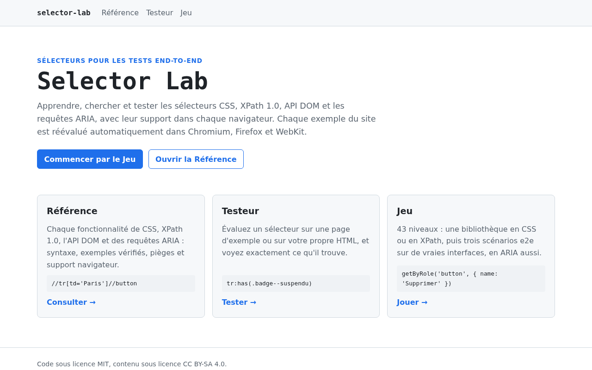
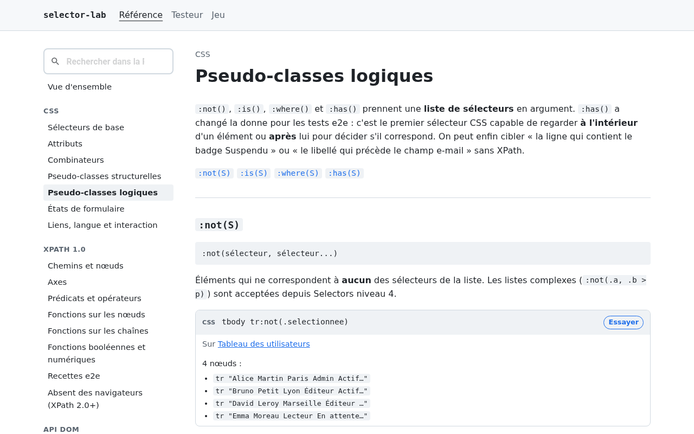
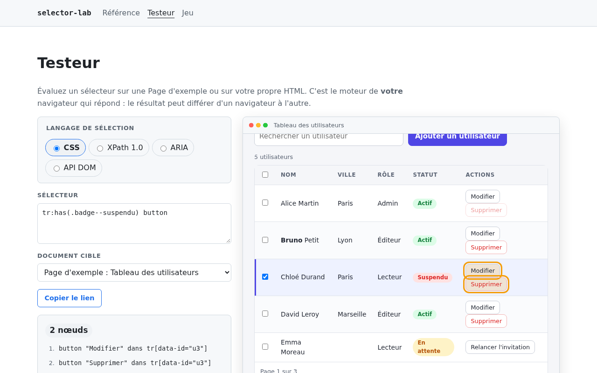
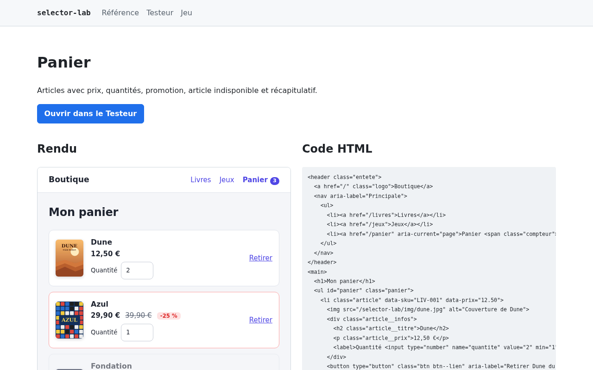
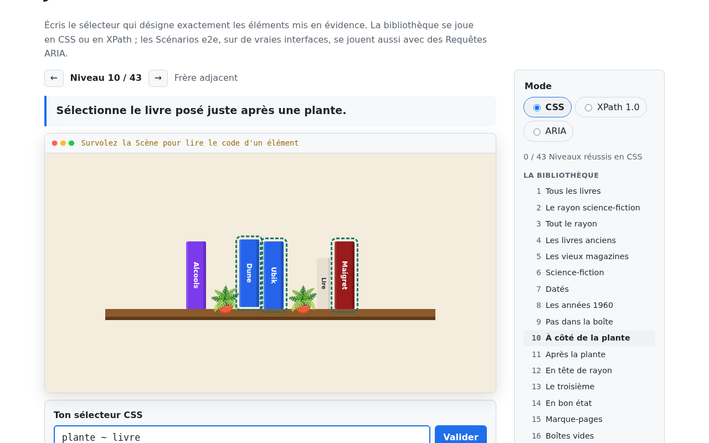
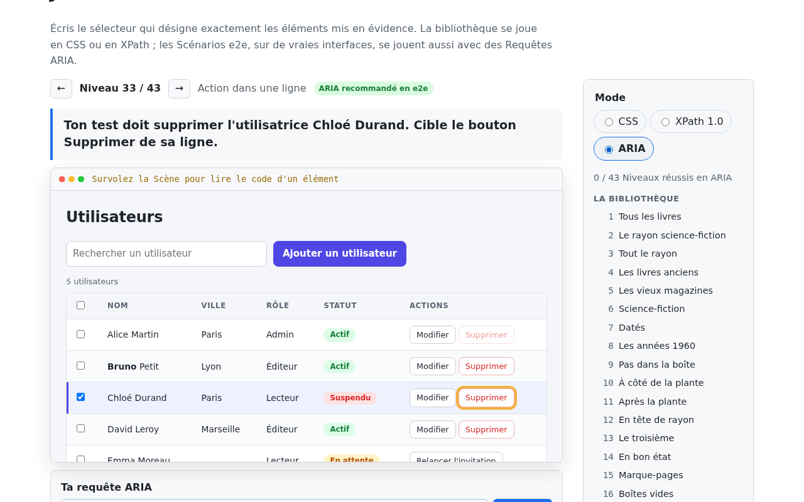

# Selector Lab

Site statique pour apprendre, chercher et tester les sélecteurs utilisés en tests end-to-end : CSS, XPath 1.0, API DOM et requêtes ARIA, avec leur support dans chaque navigateur.

- **Référence** : CSS, XPath 1.0, API DOM et Requêtes ARIA : chaque fonctionnalité, ses exemples, ses pièges et son support navigateur.
- **Testeur** : évaluer un sélecteur sur une page d'exemple ou sur son propre HTML.
- **Jeu** : progresser niveau par niveau dans une bibliothèque (CSS ou XPath), puis dans trois Scénarios e2e sur de vraies interfaces (CSS, XPath ou ARIA).

Le vocabulaire du projet est défini dans [CONTEXT.md](CONTEXT.md).

## Aperçu

| Accueil | Référence |
| --- | --- |
|  |  |

| Testeur | Page d'exemple |
| --- | --- |
|  |  |

| Jeu : la bibliothèque | Jeu : un Scénario e2e en ARIA |
| --- | --- |
|  |  |


Les captures se régénèrent avec `npm run build && npm run captures`.

## Développement

Node 22.12 ou plus récent est requis (voir `.nvmrc`).

```bash
nvm use
npm install
npm run dev
```

## Tests

Les tests Playwright tournent contre le site construit. La vérification des Exemples (`exemples.spec.ts`) tourne
dans Chromium, Firefox et WebKit ; les tests d'interface, volontairement peu nombreux, dans Chromium seulement :

```bash
npx playwright install chromium firefox webkit
npm run build
npm test
```

## Contenu de la Référence

Chaque page de la Référence est un fichier YAML dans `src/content/reference/<langage>/`, et la page
« CSS vs XPath » est `src/content/comparaison.yaml`. Les Pages d'exemple sont dans `src/pages-exemple/`.

Chaque Exemple déclare son Résultat typé attendu (`attendu`). Pour ajouter un Exemple :

1. écrire le `selecteur` et la `page`, sans `attendu` ;
2. lancer `npm run build && npm run attendus` : le script évalue l'Exemple dans Chromium et écrit le résultat ;
3. **relire** le résultat écrit, puis `npm test` vérifie qu'il est identique dans Firefox et WebKit.

Les Niveaux du Jeu sont dans `src/content/niveaux.yaml` (l'ordre du fichier est l'ordre de jeu). Leurs
Solutions de référence passent par le même circuit : `npm run attendus` calcule leur résultat, et la CI vérifie
que les solutions CSS et XPath d'un même Niveau renvoient exactement les mêmes nœuds dans les trois moteurs.

`npm run verifier-contenu` signale les erreurs de syntaxe YAML et les pièges connus (un `#` sans guillemets
est lu comme un commentaire). Le Support navigateur vient de `@mdn/browser-compat-data` et `web-features`,
mis à jour avec les dépendances.

## Styles

`src/styles/` contient un fichier par partie du site (`global.css` pour la base et les composants partagés,
puis `accueil.css`, `reference.css`, `testeur.css`, `jeu.css`, `pages-exemple.css`).

Les Pages d'exemple ont leurs propres styles dans `src/pages-exemple/styles/` (`commun.css` plus un fichier par
page). Ils sont appliqués par `adoptedStyleSheets`, sans jamais modifier le DOM, et ne doivent ni masquer
d'élément ni générer de texte : `npm run verifier-contenu` le contrôle.

## Déploiement

Chaque push sur `main` lance le build et les tests, puis le déploiement sur GitHub Pages si tout passe.

## Licences

- Code : [MIT](LICENSE)
- Contenu (Référence, Niveaux, Indices) : [CC BY-SA 4.0](LICENSE-CONTENT.md)
